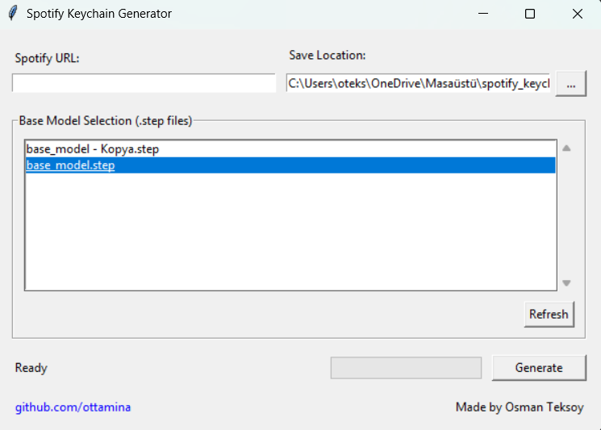

# 🎵 Spotify Keychain 3D Model Generator

A desktop application that creates 3D printable keychain models from Spotify song, album, artist, or playlist links.

[Features](#features) • [Demo](#demo) • [Usage](#usage) • [Credits](#credits) • [License](#license)

---

## ✨ Features

- 🖥️ **User-friendly interface** - No command line needed
- 📁 **Multiple model support** - Choose from different keychain designs
- 🔗 **Automatic Spotify code generation** - Just paste a link
- 📦 **STL export** - Ready for 3D printing

---

## 🎬 Demo



1. Launch the application
2. Paste a Spotify link
3. Select a base model
4. Click "Generate"
5. Get your STL file and 3D print it!

---

## 📖 Usage

### Requirements
- Python 3.8+
- cadquery
- requests  
- pillow

### Installation

```bash
pip install cadquery requests pillow
```

### Running

```bash
python gui.py
```

### Base Models

Place your `.step` files in the `base_models` folder next to the application. The app will automatically detect and list them.

---

## 🙏 Credits

This project is a fork of [spotify_keychain_3D_model](https://github.com/ricdigi/spotify_keychain_3D_model) by [Riccardo Di Girolamo](https://github.com/ricdigi).

**Original work:**
- Spotify code parsing logic
- 3D model generation algorithm
- Base keychain STEP models

**Added in this fork:**
- Desktop GUI application (Tkinter)
- Multiple base model selection
- Windows executable support

---

## 📄 License

This project is licensed under the MIT License - see the [LICENSE](LICENSE) file for details.

Original Copyright (c) 2024 Riccardo Di Girolamo

---

<p align="center">
  <a href="https://github.com/ottamina">Osman Teksoy</a><br>
  ⭐ Star this repo if you like it!<br>
  Made with ❤️ in Turkey
</p>
